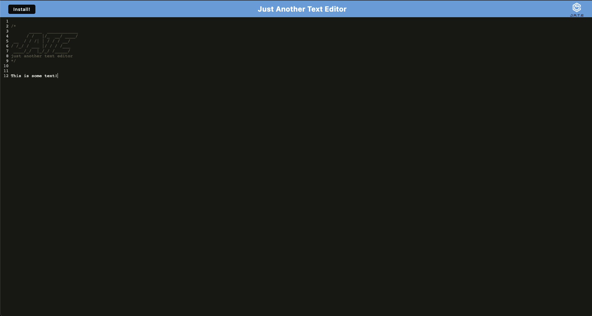

# Just Another Text Editor: A Progressive Web Application 

## Description

Just Another Text Editor is just that, a text editor. The great thing about this text editor is that you can access it offline.
If you desire to, the application can also be installed to use outside of the browser.

## Table of Contents 

- [Installation](#Installation)
- [Usage](#Usage)
- [Credits](#Credits)
- [License](#License)

## Installation

For developement:

-   In the terminal while in the root level run: `npm i`

In production:

-   Click the install button

## Usage

While in developement run the command `npm run start:dev` to build the application and start the server. In production you can add and delete text in the text area.
As you type and delete, your changes are saved and will still show up even if not connected to the server. Visit the deployed application here: http://jatext-editor.herokuapp.com

Example of the deloyed application:

## Credits

N/A 

## License

See LICENSE above